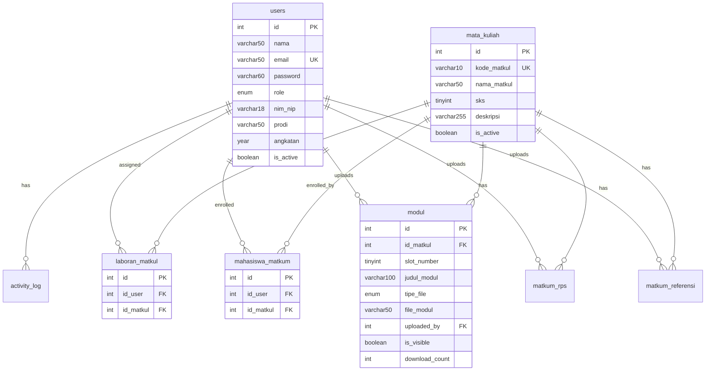

# Dokumentasi Database E-Modul Praktikum

Database ini digunakan untuk mengelola sistem E-Modul Praktikum yang memungkinkan admin, laboran, dan mahasiswa untuk mengelola modul pembelajaran.

---

## Daftar Tabel

| No | Nama Tabel | Keterangan |
|----|------------|------------|
| 1 | `users` | Menyimpan data pengguna (admin, laboran, mahasiswa) |
| 2 | `mata_kuliah` | Menyimpan data mata praktikum |
| 3 | `modul` | Menyimpan data modul/materi praktikum |
| 4 | `matkum_rps` | Menyimpan file RPS (Rencana Pembelajaran Semester) |
| 5 | `matkum_referensi` | Menyimpan referensi tambahan (file/link) |
| 6 | `laboran_matkul` | Relasi penugasan laboran ke mata praktikum |
| 7 | `mahasiswa_matkum` | Relasi pendaftaran mahasiswa ke mata praktikum |
| 8 | `activity_log` | Log aktivitas pengguna dalam sistem |

---

## Detail Struktur Tabel

### 1. Tabel `users`

Tabel `users` merupakan tabel utama yang menyimpan seluruh data pengguna sistem. Setiap pengguna memiliki role yang menentukan hak aksesnya: **admin** dapat mengelola seluruh sistem termasuk user dan mata praktikum, **laboran** bertugas mengelola konten pembelajaran (modul, RPS, referensi) untuk mata praktikum yang ditugaskan kepadanya, sedangkan **mahasiswa** hanya dapat mengakses dan mengunduh materi dari mata praktikum yang diikutinya. Password disimpan dalam bentuk hash bcrypt untuk keamanan.

| Field | Tipe Data | Keterangan |
|-------|-----------|------------|
| `id` | int | Primary key, auto increment |
| `nama` | varchar(50) | Nama lengkap pengguna |
| `email` | varchar(50) | Email pengguna (unique), digunakan untuk login |
| `password` | varchar(60) | Password yang sudah di-hash menggunakan bcrypt |
| `role` | enum | Role pengguna: `admin`, `laboran`, atau `mahasiswa` |
| `nim_nip` | varchar(18) | NIM untuk mahasiswa, NIP untuk admin/laboran |
| `prodi` | varchar(50) | Program studi (khusus mahasiswa) |
| `angkatan` | year(4) | Tahun angkatan (khusus mahasiswa) |
| `foto` | varchar(50) | Path file foto profil (opsional) |
| `is_active` | tinyint(1) | Status aktif: 1 = aktif, 0 = nonaktif |
| `created_at` | timestamp | Waktu pembuatan akun |
| `updated_at` | timestamp | Waktu terakhir diperbarui |

---

### 2. Tabel `mata_kuliah`

Tabel mata_kuliah menyimpan daftar mata praktikum yang tersedia dalam sistem. Setiap mata praktikum memiliki kode unik dan dapat berisi hingga 16 slot modul pembelajaran. Admin dapat mengaktifkan atau menonaktifkan mata praktikum melalui field is_active. Tabel ini menjadi pusat relasi untuk konten pembelajaran (modul, RPS, referensi) serta penugasan laboran dan pendaftaran mahasiswa.

| Field | Tipe Data | Keterangan |
|-------|-----------|------------|
| `id` | int | Primary key, auto increment |
| `kode_matkul` | varchar(10) | Kode unik mata praktikum |
| `nama_matkul` | varchar(50) | Nama mata praktikum |
| `sks` | tinyint | Jumlah SKS (default: 1) |
| `deskripsi` | varchar(255) | Deskripsi mata praktikum (opsional) |
| `is_active` | tinyint(1) | Status aktif: 1 = aktif, 0 = nonaktif |
| `created_at` | timestamp | Waktu pembuatan |
| `updated_at` | timestamp | Waktu terakhir diperbarui |

---

### 3. Tabel `modul`

Tabel modul menyimpan materi pembelajaran utama untuk setiap mata praktikum. Sistem menggunakan konsep slot (1-16) yang merepresentasikan pertemuan atau bab dalam satu semester. Setiap slot hanya dapat diisi satu modul. Konten modul dapat berupa file PDF, video, link eksternal, atau tipe lainnya. Laboran dapat mengatur visibilitas modul menggunakan field `is_visible` untuk menyembunyikan materi yang belum siap dipublikasikan. Field `download_count` mencatat statistik akses modul oleh mahasiswa.

| Field | Tipe Data | Keterangan |
|-------|-----------|------------|
| `id` | int | Primary key, auto increment |
| `id_matkul` | int | Foreign key ke tabel `mata_kuliah` |
| `slot_number` | tinyint | Nomor slot/pertemuan (1-16) |
| `judul_modul` | varchar(100) | Judul modul |
| `deskripsi` | varchar(255) | Deskripsi modul (opsional) |
| `tipe_file` | enum | Tipe konten: `pdf`, `video`, `link`, `lainnya` |
| `file_modul` | varchar(50) | Nama file yang diupload (untuk pdf/video) |
| `link_external` | varchar(255) | URL eksternal (untuk tipe link) |
| `uploaded_by` | int | Foreign key ke `users`, ID pengunggah |
| `is_visible` | tinyint(1) | Visibilitas: 1 = tampil, 0 = tersembunyi |
| `download_count` | int | Jumlah download/akses modul |
| `created_at` | timestamp | Waktu upload |
| `updated_at` | timestamp | Waktu terakhir diperbarui |

> **Catatan:** Kombinasi `id_matkul` + `slot_number` bersifat unique untuk memastikan satu slot hanya memiliki satu modul.

---

### 4. Tabel `matkum_rps`

Tabel `matkum_rps` menyimpan dokumen RPS (Rencana Pembelajaran Semester) untuk setiap mata praktikum. RPS berisi rencana pembelajaran, tujuan, metode evaluasi, dan jadwal pertemuan selama satu semester. Satu mata praktikum dapat memiliki lebih dari satu file RPS. File yang diupload akan disimpan di folder `uploads/rps/` dengan nama terenkripsi.

| Field | Tipe Data | Keterangan |
|-------|-----------|------------|
| `id` | int | Primary key, auto increment |
| `id_matkul` | int | Foreign key ke tabel `mata_kuliah` |
| `judul` | varchar(100) | Judul RPS |
| `file_path` | varchar(50) | Nama file RPS yang diupload |
| `uploaded_by` | int | Foreign key ke `users`, ID pengunggah |
| `created_at` | timestamp | Waktu upload |
| `updated_at` | timestamp | Waktu terakhir diperbarui |

---

### 5. Tabel `matkum_referensi`

Tabel `matkum_referensi` menyimpan materi pendukung pembelajaran yang dapat berupa file dokumen atau link eksternal. Referensi bisa berupa jurnal, ebook, video YouTube, atau sumber belajar lainnya. Field `tipe` menentukan apakah referensi berupa file yang diupload atau link ke sumber eksternal. Berbeda dengan modul yang terbatas 16 slot, referensi tidak memiliki batasan jumlah.

| Field | Tipe Data | Keterangan |
|-------|-----------|------------|
| `id` | int | Primary key, auto increment |
| `id_matkul` | int | Foreign key ke tabel `mata_kuliah` |
| `judul` | varchar(100) | Judul referensi |
| `deskripsi` | varchar(255) | Deskripsi referensi (opsional) |
| `tipe` | enum | Tipe referensi: `file` atau `link` |
| `file_path` | varchar(50) | Nama file (untuk tipe file) |
| `link_external` | varchar(255) | URL eksternal (untuk tipe link) |
| `uploaded_by` | int | Foreign key ke `users`, ID pengunggah |
| `created_at` | timestamp | Waktu pembuatan |
| `updated_at` | timestamp | Waktu terakhir diperbarui |

---

### 6. Tabel `laboran_matkul`

Tabel `laboran_matkul` merupakan tabel pivot yang menghubungkan laboran dengan mata praktikum yang ditanganinya. Relasi ini bersifat many-to-many, artinya satu laboran dapat ditugaskan ke beberapa mata praktikum, dan satu mata praktikum dapat ditangani oleh beberapa laboran. Admin yang melakukan penugasan melalui menu "Assign Laboran" pada halaman detail mata praktikum.

| Field | Tipe Data | Keterangan |
|-------|-----------|------------|
| `id` | int | Primary key, auto increment |
| `id_user` | int | Foreign key ke `users` (role: laboran) |
| `id_matkul` | int | Foreign key ke `mata_kuliah` |
| `created_at` | timestamp | Waktu penugasan |

> **Catatan:** Kombinasi `id_user` + `id_matkul` bersifat unique untuk mencegah duplikasi penugasan.

---

### 7. Tabel `mahasiswa_matkum`

Tabel `mahasiswa_matkum` merupakan tabel pivot yang menghubungkan mahasiswa dengan mata praktikum yang diikutinya. Mahasiswa hanya dapat mengakses modul dari mata praktikum yang sudah didaftarkan oleh admin. Pendaftaran dilakukan melalui menu "Assign Mahasiswa" pada halaman detail mata praktikum. Mahasiswa yang belum terdaftar tidak akan melihat mata praktikum tersebut di dashboard mereka.

| Field | Tipe Data | Keterangan |
|-------|-----------|------------|
| `id` | int | Primary key, auto increment |
| `id_user` | int | Foreign key ke `users` (role: mahasiswa) |
| `id_matkul` | int | Foreign key ke `mata_kuliah` |
| `created_at` | timestamp | Waktu pendaftaran |

> **Catatan:** Kombinasi `id_user` + `id_matkul` bersifat unique untuk mencegah duplikasi pendaftaran.

---

### 8. Tabel `activity_log`

Tabel `activity_log` mencatat seluruh aktivitas penting yang dilakukan pengguna dalam sistem untuk keperluan audit dan monitoring. Setiap aktivitas seperti login, logout, upload modul, hapus konten, dan pengelolaan user dicatat lengkap dengan informasi IP address dan browser yang digunakan. Admin dapat melihat log ini melalui menu "Log Aktivitas" untuk memantau penggunaan sistem dan mendeteksi aktivitas mencurigakan.

| Field | Tipe Data | Keterangan |
|-------|-----------|------------|
| `id` | int | Primary key, auto increment |
| `id_user` | int | Foreign key ke `users`, pelaku aktivitas |
| `action` | varchar(30) | Jenis aksi (login, logout, upload_modul, dll) |
| `description` | varchar(100) | Deskripsi detail aktivitas |
| `ip_address` | varchar(45) | Alamat IP pengguna |
| `user_agent` | varchar(150) | Browser/device pengguna |
| `created_at` | timestamp | Waktu aktivitas |

---

## Ringkasan Optimasi Ukuran Field

| Kategori | Sebelum | Sesudah | Keterangan |
|----------|---------|---------|------------|
| `nama` | varchar(100) | varchar(50) | Cukup untuk nama Indonesia |
| `email` | varchar(100) | varchar(50) | Email normal < 50 karakter |
| `password` | varchar(255) | varchar(60) | bcrypt selalu 60 karakter |
| `nim_nip` | varchar(20) | varchar(18) | NIP max 18 digit |
| `prodi` | varchar(100) | varchar(50) | Nama prodi cukup 50 |
| `foto` | varchar(255) | varchar(50) | Hash filename ~40 karakter |
| `kode_matkul` | varchar(20) | varchar(10) | Kode matkul pendek |
| `nama_matkul` | varchar(100) | varchar(50) | Nama matkul cukup 50 |
| `sks` | int(11) | tinyint | SKS max 6-8 |
| `deskripsi` | text | varchar(255) | Deskripsi singkat cukup |
| `judul_modul` | varchar(200) | varchar(100) | Judul cukup 100 |
| `judul` | varchar(200) | varchar(100) | Judul cukup 100 |
| `file_path` | varchar(255) | varchar(50) | Hash filename ~40 karakter |
| `file_modul` | varchar(255) | varchar(50) | Hash filename ~40 karakter |
| `link_external` | varchar(500) | varchar(255) | URL umumnya < 255 |
| `slot_number` | int(11) | tinyint | Slot max 16 |
| `action` | varchar(100) | varchar(30) | Action name pendek |
| `description` | text | varchar(100) | Deskripsi singkat |
| `user_agent` | varchar(255) | varchar(150) | User agent dipotong |

---

## Diagram Relasi

---

## Jenis Aksi pada Activity Log

| Action | Keterangan |
|--------|------------|
| `login` | Pengguna berhasil login |
| `logout` | Pengguna logout |
| `create_user` | Admin membuat user baru |
| `update_user` | Admin memperbarui data user |
| `delete_user` | Admin menghapus user |
| `import_users` | Admin import user dari CSV |
| `create_matkum` | Admin membuat mata praktikum baru |
| `update_matkum` | Admin memperbarui mata praktikum |
| `delete_matkum` | Admin menghapus mata praktikum |
| `assign_laboran` | Admin menugaskan laboran ke matkum |
| `remove_laboran` | Admin menghapus penugasan laboran |
| `assign_mahasiswa` | Admin mendaftarkan mahasiswa ke matkum |
| `remove_mahasiswa` | Admin menghapus pendaftaran mahasiswa |
| `upload_modul` | Upload modul baru |
| `update_modul` | Memperbarui modul |
| `delete_modul` | Menghapus modul |
| `upload_rps` | Upload RPS |
| `delete_rps` | Menghapus RPS |
| `upload_referensi` | Upload referensi |
| `delete_referensi` | Menghapus referensi |
