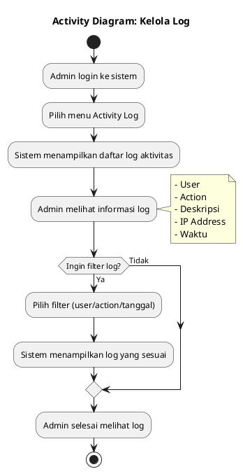
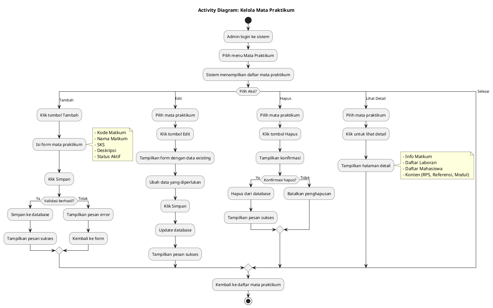
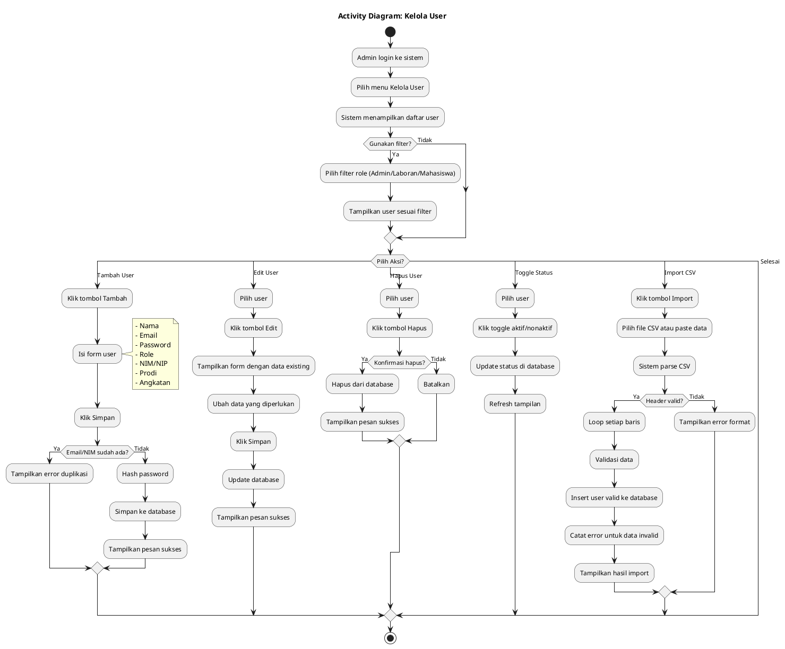
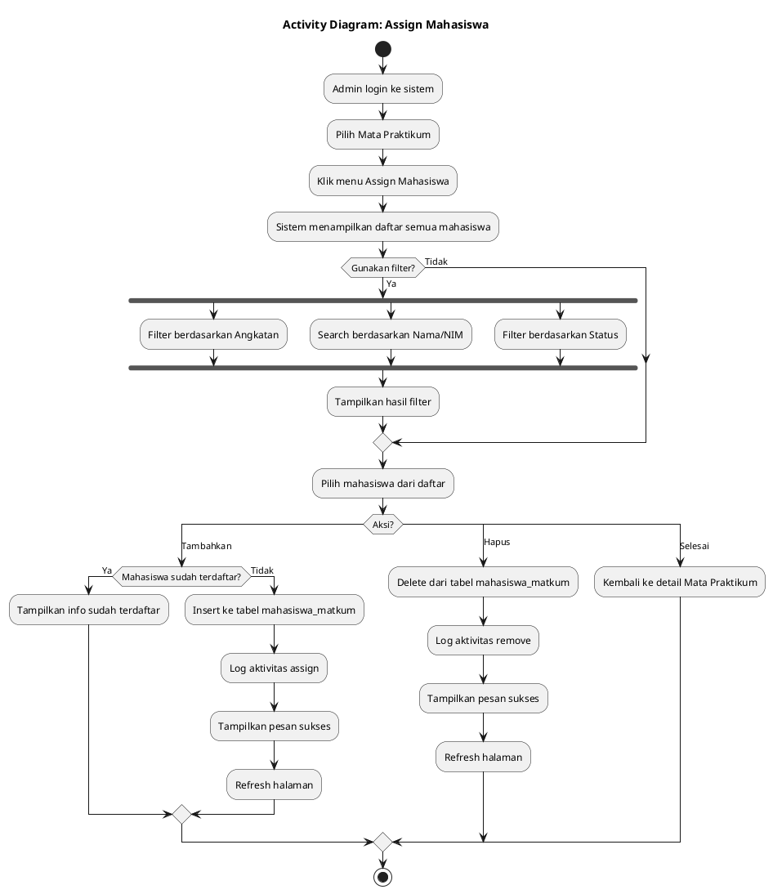
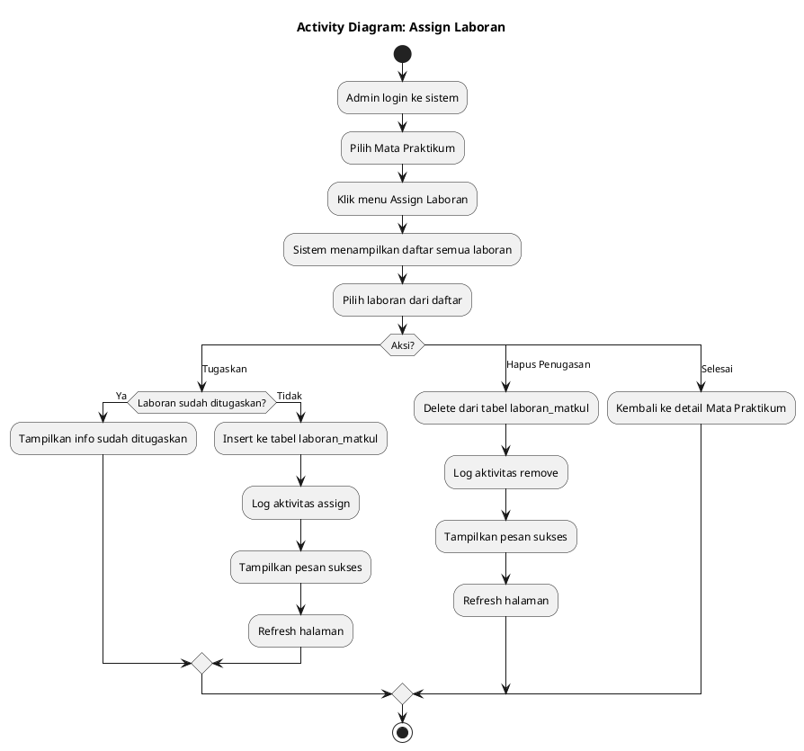
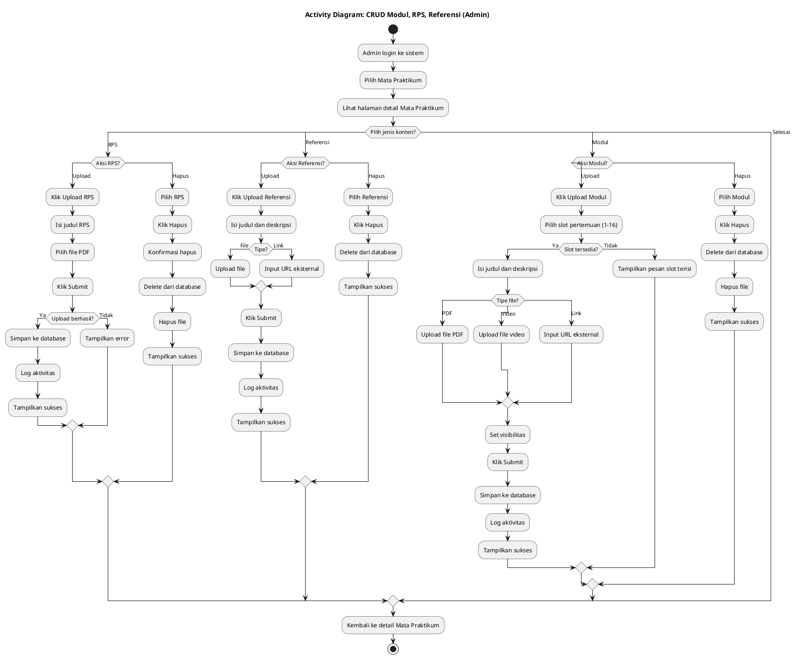
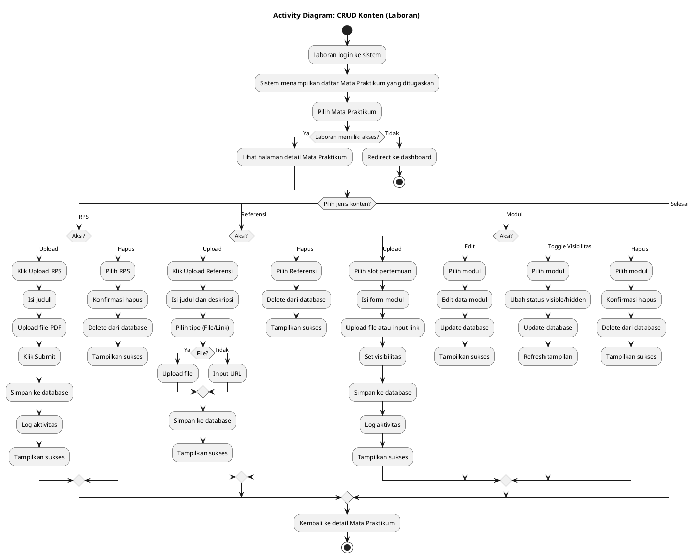
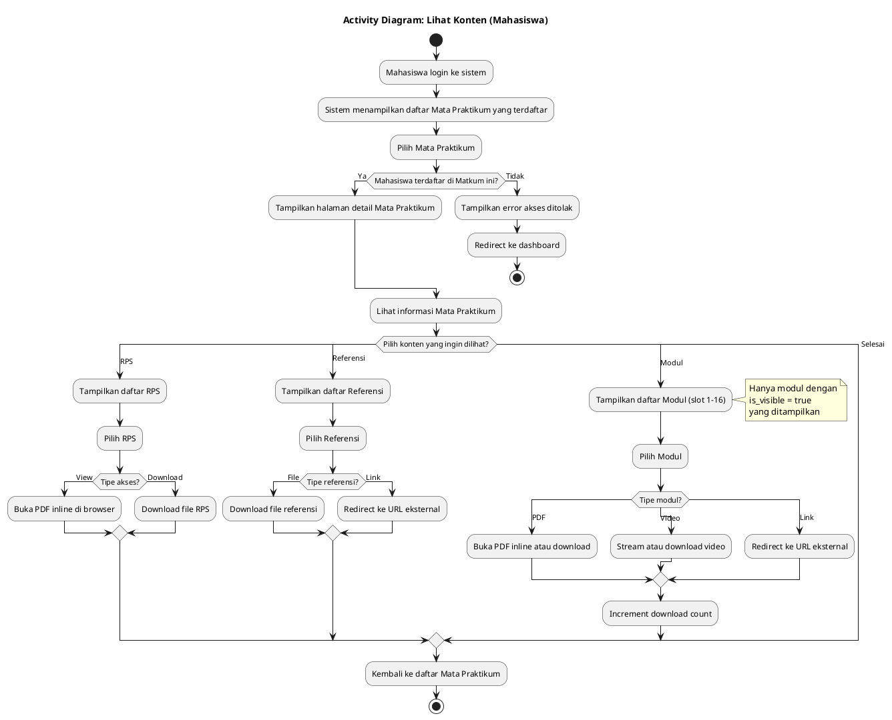
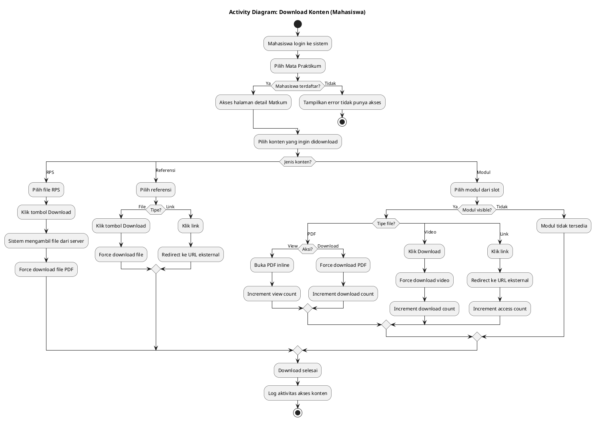

# Activity Diagram PlantUML - E-Modul Praktikum

Dokumen ini berisi 9 Activity Diagram dalam format PlantUML berdasarkan Use Case yang telah ditentukan.

---

## Daftar Use Case

| No | Use Case | Aktor |
|----|----------|-------|
| 1 | Kelola Log | Admin |
| 2 | Kelola Mata Praktikum | Admin |
| 3 | Kelola User | Admin |
| 4 | Assign Mahasiswa | Admin |
| 5 | Assign Laboran | Admin |
| 6 | CRUD Modul, RPS, Referensi (Konten) | Admin |
| 7 | CRUD Konten | Laboran |
| 8 | Lihat Konten | Mahasiswa |
| 9 | Download Konten | Mahasiswa |

---

## 1. Activity Diagram - Kelola Log (Admin)



---

## 2. Activity Diagram - Kelola Mata Praktikum (Admin)



---

## 3. Activity Diagram - Kelola User (Admin)



---

## 4. Activity Diagram - Assign Mahasiswa (Admin)



---

## 5. Activity Diagram - Assign Laboran (Admin)



---

## 6. Activity Diagram - CRUD Modul, RPS, Referensi (Admin)



---

## 7. Activity Diagram - CRUD Konten (Laboran)



---

## 8. Activity Diagram - Lihat Konten (Mahasiswa)



---

## 9. Activity Diagram - Download Konten (Mahasiswa)



---

## Cara Menggunakan PlantUML

### Online Editor
1. Buka [PlantUML Web Server](http://www.plantuml.com/plantuml/uml/)
2. Copy-paste kode diagram
3. Klik Submit untuk generate gambar
4. Download hasil dalam format PNG/SVG

### VS Code Extension
1. Install extension "PlantUML"
2. Buat file dengan ekstensi `.puml`
3. Paste kode diagram
4. Tekan `Alt+D` untuk preview

### Command Line
```bash
java -jar plantuml.jar diagram.puml
```

---

## Ringkasan

| No | Activity Diagram | Use Case | Aktor |
|----|-----------------|----------|-------|
| 1 | AD_Kelola_Log | Kelola Log | Admin |
| 2 | AD_Kelola_Matkum | Kelola Mata Praktikum | Admin |
| 3 | AD_Kelola_User | Kelola User | Admin |
| 4 | AD_Assign_Mahasiswa | Assign Mahasiswa | Admin |
| 5 | AD_Assign_Laboran | Assign Laboran | Admin |
| 6 | AD_CRUD_Konten_Admin | CRUD Modul, RPS, Referensi | Admin |
| 7 | AD_CRUD_Konten_Laboran | CRUD Konten | Laboran |
| 8 | AD_Lihat_Konten | Lihat Konten | Mahasiswa |
| 9 | AD_Download_Konten | Download Konten | Mahasiswa |
