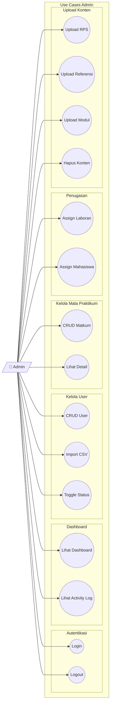
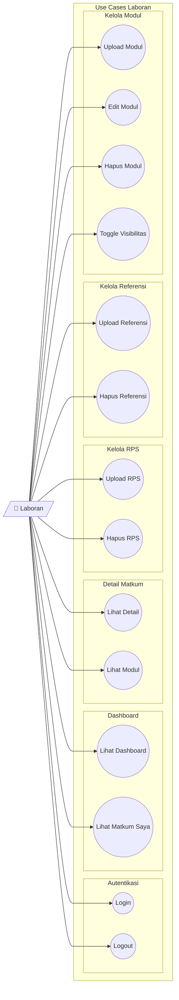
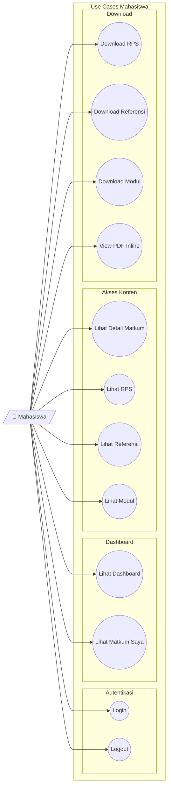
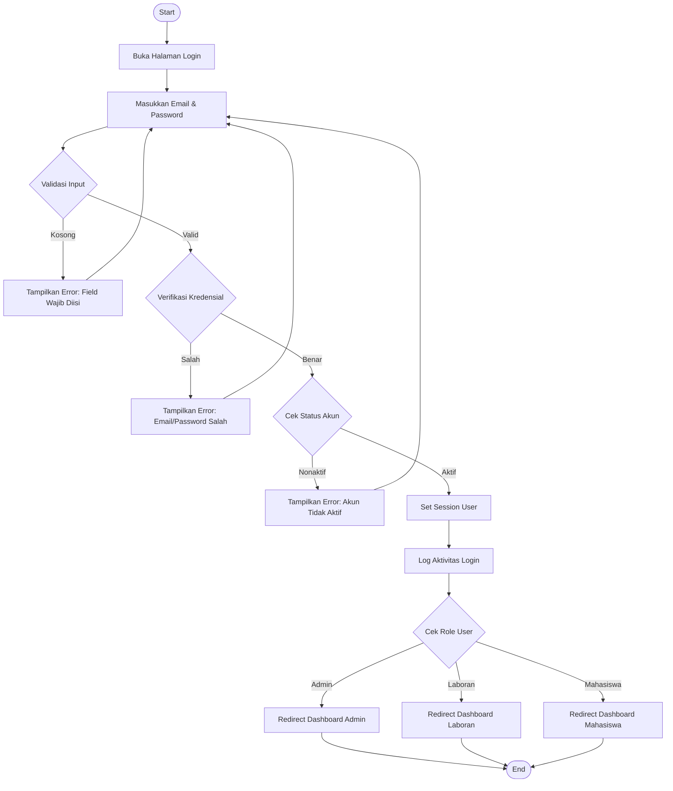
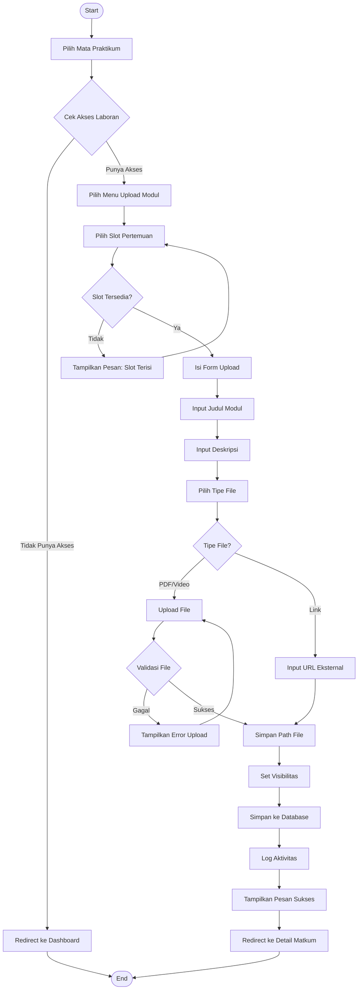
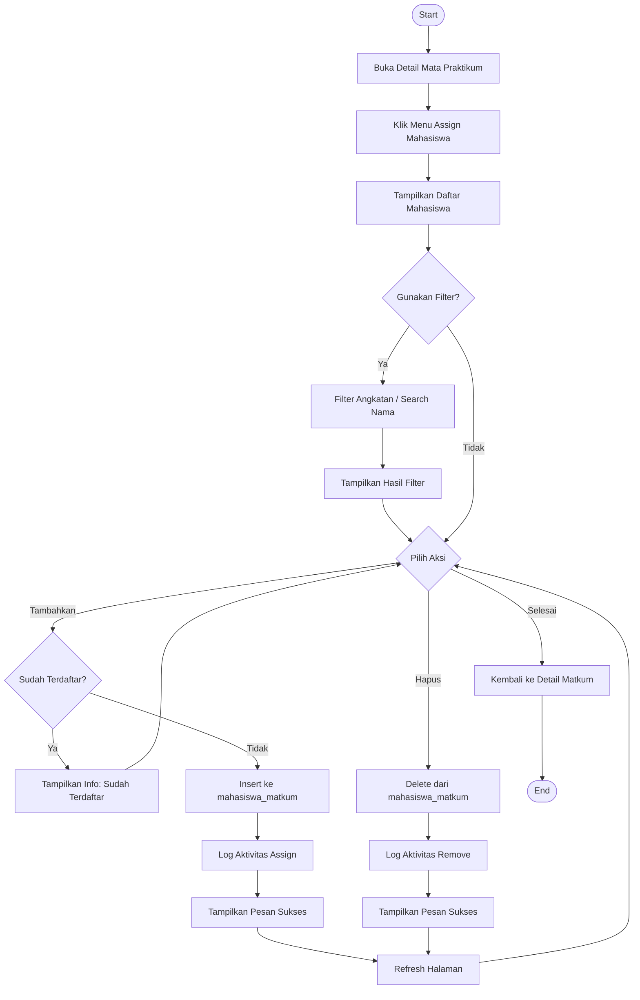
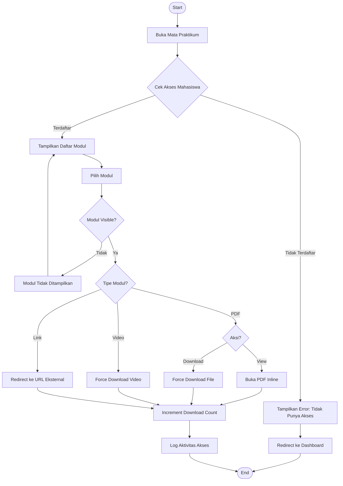
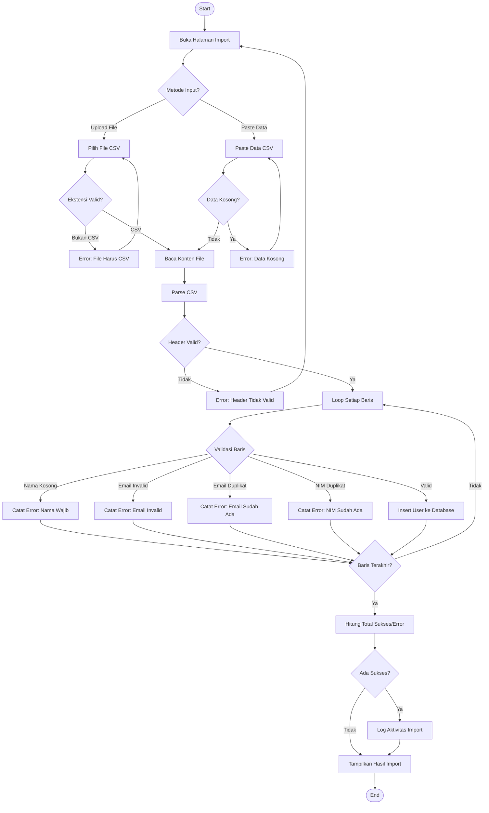
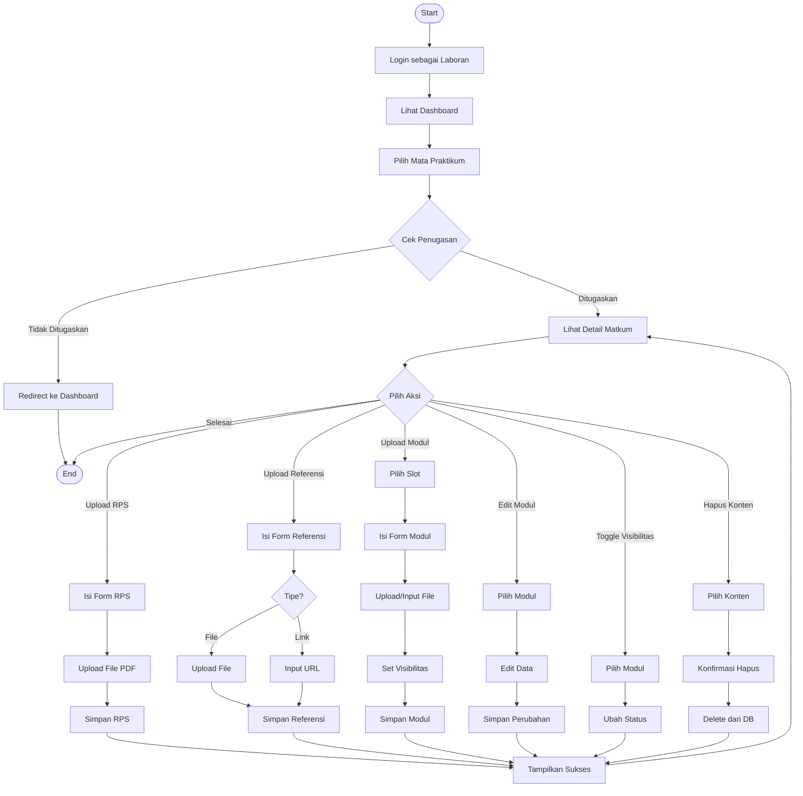

# Diagram UML E-Modul Praktikum

Dokumen ini berisi diagram Use Case dan Activity dalam format Mermaid.

---

## 1. Use Case Diagram

### 1.1 Use Case Diagram - Keseluruhan Sistem

```mermaid
graph TB
    subgraph "E-Modul Praktikum System"
        
        subgraph "Autentikasi"
            UC1((Login))
            UC2((Logout))
        end
        
        subgraph "Manajemen User"
            UC3((Lihat Daftar User))
            UC4((Tambah User))
            UC5((Edit User))
            UC6((Hapus User))
            UC7((Import User CSV))
            UC8((Toggle Status User))
        end
        
        subgraph "Manajemen Mata Praktikum"
            UC9((Lihat Daftar Matkum))
            UC10((Tambah Matkum))
            UC11((Edit Matkum))
            UC12((Hapus Matkum))
            UC13((Lihat Detail Matkum))
        end
        
        subgraph "Manajemen Penugasan"
            UC14((Assign Laboran))
            UC15((Hapus Laboran))
            UC16((Assign Mahasiswa))
            UC17((Hapus Mahasiswa))
        end
        
        subgraph "Manajemen Konten"
            UC18((Upload RPS))
            UC19((Upload Referensi))
            UC20((Upload Modul))
            UC21((Edit Modul))
            UC22((Hapus Konten))
            UC23((Toggle Visibilitas))
        end
        
        subgraph "Akses Konten"
            UC24((Lihat RPS))
            UC25((Lihat Referensi))
            UC26((Lihat Modul))
            UC27((Download Konten))
        end
        
        UC28((Lihat Activity Log))
        UC29((Lihat Dashboard))
    end
    
    Admin[/"👤 Admin"/]
    Laboran[/"👤 Laboran"/]
    Mahasiswa[/"👤 Mahasiswa"/]
    
    Admin --- UC1 & UC2 & UC29
    Admin --- UC3 & UC4 & UC5 & UC6 & UC7 & UC8
    Admin --- UC9 & UC10 & UC11 & UC12 & UC13
    Admin --- UC14 & UC15 & UC16 & UC17
    Admin --- UC18 & UC19 & UC20 & UC22
    Admin --- UC28
    
    Laboran --- UC1 & UC2 & UC29
    Laboran --- UC13
    Laboran --- UC18 & UC19 & UC20 & UC21 & UC22 & UC23
    
    Mahasiswa --- UC1 & UC2 & UC29
    Mahasiswa --- UC13
    Mahasiswa --- UC24 & UC25 & UC26 & UC27
```

---

### 1.2 Use Case Diagram - Admin

---

### 1.3 Use Case Diagram - Laboran

---

### 1.4 Use Case Diagram - Mahasiswa

---

## 2. Activity Diagram

### 2.1 Activity Diagram - Login

---

### 2.2 Activity Diagram - Upload Modul (Laboran)

---

### 2.3 Activity Diagram - Assign Mahasiswa ke Mata Praktikum (Admin)

---

### 2.4 Activity Diagram - Download/Akses Modul (Mahasiswa)

---

### 2.5 Activity Diagram - Import User CSV (Admin)

---

### 2.6 Activity Diagram - Kelola Konten Mata Praktikum (Laboran)

---

## 3. Ringkasan Diagram

| No | Diagram | Tipe | Deskripsi |
|----|---------|------|-----------|
| 1 | Use Case Keseluruhan | Use Case | Gambaran seluruh fitur sistem |
| 2 | Use Case Admin | Use Case | Fitur khusus role Admin |
| 3 | Use Case Laboran | Use Case | Fitur khusus role Laboran |
| 4 | Use Case Mahasiswa | Use Case | Fitur khusus role Mahasiswa |
| 5 | Login | Activity | Proses autentikasi pengguna |
| 6 | Upload Modul | Activity | Proses laboran upload modul |
| 7 | Assign Mahasiswa | Activity | Proses admin assign mahasiswa |
| 8 | Download Modul | Activity | Proses mahasiswa akses konten |
| 9 | Import CSV | Activity | Proses admin import user massal |
| 10 | Kelola Konten | Activity | Alur kerja laboran kelola konten |

---

## 4. Cara Menggunakan

### Render di Markdown Editor
Diagram Mermaid dapat dirender di:
- GitHub/GitLab Markdown
- VS Code dengan extension Mermaid
- Notion
- Obsidian
- [Mermaid Live Editor](https://mermaid.live/)

### Export ke Gambar
1. Buka [Mermaid Live Editor](https://mermaid.live/)
2. Copy-paste kode diagram
3. Klik tombol Export (PNG/SVG)
